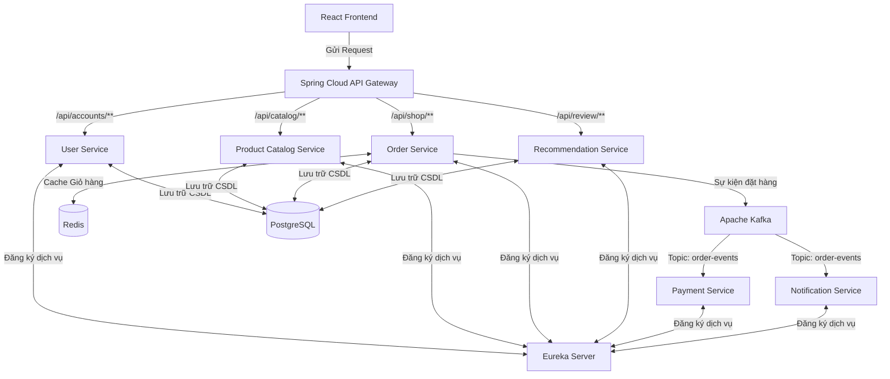

# THÔNG TIN SINH VIÊN

| Thông tin | Chi tiết |
| :--- | :--- |
| **Sinh viên thực hiện** | Ung Thị Thanh Thảo |
| **MSSV** | 2123110174 |
| **Lớp** | CCQ2311E |
| **Môn học** | Chuyên đề ứng dụng lập trình WEB 2 |

---

# HỆ THỐNG THƯƠNG MẠI ĐIỆN TỬ - HIGHLANDS COFFEE (MICROSERVICES)

Đồ án này trình bày cách xây dựng một hệ thống đặt món trực tuyến cho **Highlands Coffee** bằng kiến trúc **Microservices**. Dự án sử dụng nền tảng **Spring Boot**, **Spring Cloud** cho phía Backend và **React (Vite)** cho phía Frontend, kết hợp cùng các công nghệ hiện đại như **PostgreSQL**, **Redis** và **Apache Kafka**.

---

## 📌 Kiến Trúc Hệ Thống

Hệ thống tuân theo kiến trúc Microservices và định hướng sự kiện (Event-Driven Architecture), giao tiếp thông qua Kafka và định tuyến qua API Gateway.



---

## 🛠️ Công Nghệ Áp Dụng

### 1. Phía Server (Backend)
- **Java 21 & Spring Boot 3.3.0**
- **Spring Cloud** (API Gateway, Eureka Server, OpenFeign)
- **Spring Data JPA & Hibernate**
- **Bảo mật:** JWT (JSON Web Token)

### 2. Phía Client (Frontend)
- **ReactJS (Vite)**
- **UI/UX:** Bootstrap 5, FontAwesome, CSS tuỳ chỉnh (Highlands Theme)
- **Call API:** Axios
- **Quản lý Phiên:** `sessionStorage` (Ngăn chặn lỗi ghi đè dữ liệu đăng nhập khi mở nhiều tab)

### 3. Cơ Sở Dữ Liệu & Middleware
- **PostgreSQL**: Lưu thông tin người dùng, đơn đặt hàng, đồ uống/sản phẩm, và đánh giá.
- **Redis**: Bộ nhớ đệm giúp quản lý giỏ hàng của người dùng với tốc độ cao.
- **Apache Kafka**: Xử lý các tác vụ bất đồng bộ như thanh toán và gửi thông báo.
- **Docker & Docker Compose**: Đóng gói và chạy các dịch vụ môi trường (Kafka, Redis, Zookeeper).

---

## 📂 Chi Tiết Các Microservices

| Tên Dịch vụ | Chức năng chính |
| :--- | :--- |
| **`eureka-server`** | Đóng vai trò là máy chủ Service Discovery, lưu trữ danh sách các service đang hoạt động. |
| **`api-gateway`** | Cổng giao tiếp duy nhất từ Frontend, định tuyến request đến đúng các service tương ứng ở Backend. |
| **`user-service`** | Quản lý việc đăng ký, đăng nhập, bảo mật JWT và thông tin tài khoản người dùng/admin. |
| **`product-catalog-service`** | Quản lý các mặt hàng đồ uống/bánh ngọt, xử lý các nghiệp vụ thêm sửa xóa (CRUD) danh mục và sản phẩm. |
| **`order-service`** | Xử lý nghiệp vụ thêm vào giỏ hàng và tạo mới đơn đặt hàng thức uống. |
| **`product-recommendation-service`**| Quản lý nhận xét, đánh giá từ khách hàng và gợi ý đồ uống. |
| **`payment-service`** | Lắng nghe Kafka event để xử lý giao dịch thanh toán khi có đơn đặt hàng mới. |
| **`notification-service`** | Lắng nghe Kafka event để tự động gửi thông báo cho khách hàng khi đặt hàng thành công. |

---

## 🌟 Chức Năng Nổi Bật

### Phân Hệ Khách Hàng (User)
- **Trang chủ & Danh mục:** Hiển thị thực đơn (Cà phê, Trà, Freeze, Bánh Mì Quế...) với giao diện đậm chất Highlands Coffee.
- **Tìm kiếm đồ uống:** Xem chi tiết thông tin, mô tả, giá cả các loại đồ uống.
- **Giỏ hàng trực tuyến:** Thêm món và chỉnh sửa số lượng, dữ liệu đồng bộ cực nhanh nhờ Redis.
- **Đặt hàng & Theo dõi:** Chốt đơn hàng mượt mà (Đặt trước - Lấy ngay) và lưu lại lịch sử giao dịch.

### Phân Hệ Quản Trị Viên (Admin)
- **Quản lý Thực đơn:** CRUD danh mục thức uống, thêm mới sản phẩm, cập nhật trạng thái bán.
- **Quản lý Đơn hàng:** Xem và theo dõi trạng thái các đơn đặt món của khách hàng.
- **Quản lý Tài khoản:** Xem danh sách khách hàng đã đăng ký tham gia trên hệ thống (Highlands Rewards).

---

## 🚀 Hướng Dẫn Cài Đặt và Chạy Dự Án

### Yêu cầu hệ thống:
- Hệ máy đã cài đặt sẵn **Java 21** và **Node.js 18+**.
- **PostgreSQL** (Port `5432`).
- **Docker Desktop** để chạy Kafka và Redis.

### Bước 1: Chuẩn bị Cơ sở dữ liệu
Mở PostgreSQL và tạo một database trống mang tên `ecommerce_microservices_db`. Hệ thống dùng cấu hình mặc định (Tài khoản: `postgres` / Mật khẩu: `123456`). Khi chạy mã nguồn, Spring Boot sẽ tự động thiết lập các bảng.

### Bước 2: Khởi động Redis & Kafka (Docker)
Tại thư mục gốc của đồ án, mở terminal (hoặc PowerShell) và chạy lệnh:
```bash
docker-compose up -d
```

### Bước 3: Chạy các Backend Services
Sử dụng file script tiện ích `start-all.bat` đã được cấu hình sẵn để tự động bật đồng loạt tất cả các services (Eureka, Gateway, User, Catalog, Order...):
```powershell
.\start-all.bat
```
*(Chờ khoảng 1-2 phút để các cửa sổ dịch vụ chạy xong và đăng ký thành công trên Eureka)*

### Bước 4: Chạy giao diện Frontend
Mở một terminal khác, điều hướng vào thư mục `frontend`:
```bash
cd frontend
npm install
npm run dev
```
Cuối cùng, mở trình duyệt web và truy cập vào đường dẫn được hiển thị trên console (ví dụ: `http://localhost:5173` hoặc `http://localhost:5174`) để trải nghiệm ứng dụng với giao diện Highlands Coffee.
