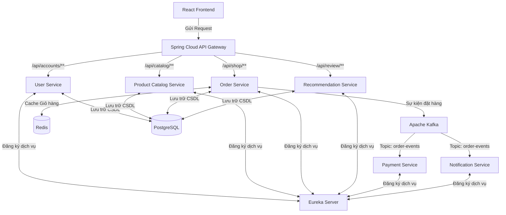

# THÔNG TIN SINH VIÊN

| Thông tin | Chi tiết |
| :--- | :--- |
| **Sinh viên thực hiện** | Ung Thị Thanh Thảo |
| **MSSV** | 2123110174 |
| **Lớp** | CCQ2311E |
| **Môn học** | Chuyên đề ứng dụng lập trình WEB 2 |

---

# HỆ THỐNG THƯƠNG MẠI ĐIỆN TỬ - HIGHLANDS COFFEE (MICROSERVICES)

Đồ án này trình bày cách xây dựng một hệ thống đặt món trực tuyến cho **Highlands Coffee** bằng kiến trúc **Microservices**. Dự án sử dụng nền tảng **Spring Boot**, **Spring Cloud** cho phía Backend và **React (Vite)** cho phía Frontend, kết hợp cùng các công nghệ hiện đại như **PostgreSQL**, **Redis** và **Apache Kafka**.

---

## 📌 Kiến Trúc Hệ Thống

Hệ thống tuân theo kiến trúc Microservices và định hướng sự kiện (Event-Driven Architecture), giao tiếp thông qua Kafka và định tuyến qua API Gateway.



---

## 🛠️ Công Nghệ Áp Dụng

### 1. Phía Server (Backend)
- **Java 21 & Spring Boot 3.3.0**
- **Spring Cloud** (API Gateway, Eureka Server, OpenFeign)
- **Spring Data JPA & Hibernate**
- **Bảo mật:** JWT (JSON Web Token)

### 2. Phía Client (Frontend)
- **ReactJS (Vite)**
- **UI/UX:** Bootstrap 5, FontAwesome, CSS tuỳ chỉnh (Highlands Theme)
- **Call API:** Axios
- **Quản lý Phiên:** `sessionStorage` (Ngăn chặn lỗi ghi đè dữ liệu đăng nhập khi mở nhiều tab)

### 3. Cơ Sở Dữ Liệu & Middleware
- **PostgreSQL**: Lưu thông tin người dùng, đơn đặt hàng, đồ uống/sản phẩm, và đánh giá.
- **Redis**: Bộ nhớ đệm giúp quản lý giỏ hàng của người dùng với tốc độ cao.
- **Apache Kafka**: Xử lý các tác vụ bất đồng bộ như thanh toán và gửi thông báo.
- **Docker & Docker Compose**: Đóng gói và chạy các dịch vụ môi trường (Kafka, Redis, Zookeeper).

---

## 📂 Chi Tiết Các Microservices

| Tên Dịch vụ | Chức năng chính |
| :--- | :--- |
| **`eureka-server`** | Đóng vai trò là máy chủ Service Discovery, lưu trữ danh sách các service đang hoạt động. |
| **`api-gateway`** | Cổng giao tiếp duy nhất từ Frontend, định tuyến request đến đúng các service tương ứng ở Backend. |
| **`user-service`** | Quản lý việc đăng ký, đăng nhập, bảo mật JWT và thông tin tài khoản người dùng/admin. |
| **`product-catalog-service`** | Quản lý các mặt hàng đồ uống/bánh ngọt, xử lý các nghiệp vụ thêm sửa xóa (CRUD) danh mục và sản phẩm. |
| **`order-service`** | Xử lý nghiệp vụ thêm vào giỏ hàng và tạo mới đơn đặt hàng thức uống. |
| **`product-recommendation-service`**| Quản lý nhận xét, đánh giá từ khách hàng và gợi ý đồ uống. |
| **`payment-service`** | Lắng nghe Kafka event để xử lý giao dịch thanh toán khi có đơn đặt hàng mới. |
| **`notification-service`** | Lắng nghe Kafka event để tự động gửi thông báo cho khách hàng khi đặt hàng thành công. |

---

## 🌟 Chức Năng Nổi Bật

### Phân Hệ Khách Hàng (User)
- **Trang chủ & Danh mục:** Hiển thị thực đơn (Cà phê, Trà, Freeze, Bánh Mì Quế...) với giao diện đậm chất Highlands Coffee.
- **Tìm kiếm đồ uống:** Xem chi tiết thông tin, mô tả, giá cả các loại đồ uống.
- **Giỏ hàng trực tuyến:** Thêm món và chỉnh sửa số lượng, dữ liệu đồng bộ cực nhanh nhờ Redis.
- **Đặt hàng & Theo dõi:** Chốt đơn hàng mượt mà (Đặt trước - Lấy ngay) và lưu lại lịch sử giao dịch.

### Phân Hệ Quản Trị Viên (Admin)
- **Quản lý Thực đơn:** CRUD danh mục thức uống, thêm mới sản phẩm, cập nhật trạng thái bán.
- **Quản lý Đơn hàng:** Xem và theo dõi trạng thái các đơn đặt món của khách hàng.
- **Quản lý Tài khoản:** Xem danh sách khách hàng đã đăng ký tham gia trên hệ thống (Highlands Rewards).

---

## 🚀 Hướng Dẫn Cài Đặt và Chạy Dự Án

### Yêu cầu hệ thống:
- Hệ máy đã cài đặt sẵn **Java 21** và **Node.js 18+**.
- **PostgreSQL** (Port `5432`).
- **Docker Desktop** để chạy Kafka và Redis.

### Bước 1: Chuẩn bị Cơ sở dữ liệu
Mở PostgreSQL và tạo một database trống mang tên `ecommerce_microservices_db`. Hệ thống dùng cấu hình mặc định (Tài khoản: `postgres` / Mật khẩu: `123456`). Khi chạy mã nguồn, Spring Boot sẽ tự động thiết lập các bảng.

### Bước 2: Khởi động Redis & Kafka (Docker)
Tại thư mục gốc của đồ án, mở terminal (hoặc PowerShell) và chạy lệnh:
```bash
docker-compose up -d
```

### Bước 3: Chạy các Backend Services
Sử dụng file script tiện ích `start-all.bat` đã được cấu hình sẵn để tự động bật đồng loạt tất cả các services (Eureka, Gateway, User, Catalog, Order...):
```powershell
.\start-all.bat
```
*(Chờ khoảng 1-2 phút để các cửa sổ dịch vụ chạy xong và đăng ký thành công trên Eureka)*

### Bước 4: Chạy giao diện Frontend
Mở một terminal khác, điều hướng vào thư mục `frontend`:
```bash
cd frontend
npm install
npm run dev
```
Cuối cùng, mở trình duyệt web và truy cập vào đường dẫn được hiển thị trên console (ví dụ: `http://localhost:5173` hoặc `http://localhost:5174`) để trải nghiệm ứng dụng với giao diện Highlands Coffee.

---

## 🗄️ Cấu Trúc Các Bảng Cơ Sở Dữ Liệu

Hệ thống bao gồm các bảng (tables) phân tán theo các dịch vụ:

- **User Service:** `users`, `user_role`, `users_details`, `notifications`
- **Product Catalog Service:** `products`, `categories`, `product_variants`
- **Order Service:** `orders`, `items`, `store_locations`, `shipping_methods`, `order_status_history`, `banners`, `voucher_redemptions`, `vouchers`, `support_tickets`
- **Product Recommendation Service:** `recommendation`

*(Lưu ý: Do sử dụng kiến trúc Microservices nên mỗi service có thể sử dụng database hoặc schema riêng rẽ)*

---

## 📅 Tiến Độ Thực Hiện (08/06/2026 - 29/06/2026)

Dưới đây là tiến độ phát triển các chức năng phân chia theo từng tuần dựa trên lịch sử commit:

### Tuần 1 (08/06 - 14/06)
- **Khởi tạo hệ thống:** Thiết lập kiến trúc Microservices cơ bản.
- **Phát triển Frontend:** Cập nhật giao diện người dùng theo chủ đề Highlands Coffee.
- **Xây dựng tính năng web:** Triển khai và cập nhật các chức năng cơ bản trên web.
- **Tài liệu:** Cập nhật file README với hướng dẫn và thông tin dự án.

### Tuần 2 (15/06 - 21/06)
- Xây dựng và thiết kế ngầm định các tính năng nâng cao, nghiên cứu tích hợp bảo mật và hệ thống gửi mail.

### Tuần 3 (22/06 - 29/06)
- **Bảo mật:** Triển khai bảo mật bằng JWT (JSON Web Token) và Rate Limiting.
- **Hệ thống Email:** Cập nhật tính năng gửi Email hóa đơn trực tiếp cho khách hàng.
- **Fix Bug & Tối ưu:** Khắc phục các lỗi kết nối dữ liệu và lỗi hiển thị giao diện Frontend.
- **Hoàn thiện:** Tổng kết và đáp ứng đủ 16 yêu cầu của đồ án, cập nhật source code hoàn chỉnh.

---

## Giữa kỳ:

### 1. Sơ lượt tổng quan về dự án (đối tượng, chức năng, các bảng, mối liên hệ)
- **Đối tượng hướng đến:** 
  - *Khách hàng:* Những người yêu thích các sản phẩm đồ uống/bánh ngọt của Highlands Coffee mong muốn đặt hàng trực tuyến nhanh chóng.
  - *Quản trị viên (Admin):* Nhân viên cửa hàng hoặc quản lý cần hệ thống theo dõi đơn hàng và cập nhật thực đơn tự động.
- **Chức năng chính:**
  - *Khách hàng:* Đăng ký/Đăng nhập, duyệt menu đồ uống, quản lý giỏ hàng trực tuyến, đặt hàng, nhận email hóa đơn điện tử tự động.
  - *Quản trị viên:* Quản lý danh mục, quản lý sản phẩm (thêm, sửa, xóa, cập nhật tình trạng bán), quản lý danh sách đơn hàng và tài khoản người dùng.
- **Các bảng dữ liệu và mối liên hệ:**
  - *Đặc thù Microservices:* Dữ liệu không tập trung ở 1 database duy nhất mà chia nhỏ cho từng Service quản lý. Các bảng liên kết ngầm với nhau qua các khóa định danh (như `user_id`, `product_id`).
  - *Nhóm bảng Người dùng (`users`, `user_role`, `users_details`):* Quản lý thông tin cá nhân và quyền truy cập (Admin/User).
  - *Nhóm bảng Sản phẩm (`categories`, `products`, `product_variants`):* Mối quan hệ 1-N (Một danh mục có nhiều sản phẩm). Chứa thông tin về đồ uống, giá cả, size.
  - *Nhóm bảng Đơn hàng (`orders`, `items`, `order_status_history`):* Chứa thông tin đơn đặt hàng. Quan hệ 1-N (Một đơn hàng có nhiều món `items`).
  - *Nhóm bảng Phụ trợ (`notifications`, `recommendation`):* Lưu trữ dữ liệu thông báo và hệ thống gợi ý món.

### 2. Quy trình hoặc mô hình dự án
- **Mô hình kiến trúc:** Ứng dụng mô hình **Microservices** kết hợp **Event-Driven Architecture** (Kiến trúc hướng sự kiện).
- **Quy trình hoạt động (User Flow) nổi bật:**
  1. Người dùng truy cập hệ thống qua cổng duy nhất là **API Gateway**.
  2. Xác thực và phân quyền được xử lý tại **User Service** (sử dụng Token JWT).
  3. Thao tác thêm vào giỏ hàng được xử lý tốc độ cao nhờ lưu trữ tạm thời trên bộ nhớ đệm **Redis**.
  4. Khi khách hàng bấm chốt đơn, **Order Service** sẽ ghi nhận dữ liệu vào CSDL PostgreSQL.
  5. Thay vì gửi email trực tiếp gây chậm hệ thống, Order Service phát ra một sự kiện (event) đưa vào **Apache Kafka**.
  6. **Notification Service** chạy ngầm, tự động hứng sự kiện từ Kafka và thực hiện gửi Email hóa đơn cho khách.

### 3. Tiến độ thực tế hiện tại
- **Tiến độ (Đạt 100% so với kế hoạch đề ra):**
  - Đã xây dựng hoàn chỉnh và kết nối thành công các Microservices (Eureka, Gateway, User, Catalog, Order, Notification...).
  - Đã hoàn thiện giao diện Frontend bằng React chuẩn phong cách Highlands Coffee.
  - Tích hợp thành công giỏ hàng Redis và luồng gửi Email tự động bằng Kafka.
  - Hệ thống đã có bảo mật JWT và chống spam API (Rate Limiting).
  - Đã sửa các lỗi hiển thị và kết nối cơ sở dữ liệu.
- **Định hướng phát triển thêm (Nếu có thời gian):**
- Tích hợp thanh toán trực tuyến qua cổng VNPay hoặc Momo.
  - Triển khai (Deploy) dự án thực tế lên môi trường Cloud (AWS hoặc Docker Swarm).

---

## 🚀 Các Tính Năng Nâng Cấp Mới (30/06/2026)

Để tối ưu hóa luồng vận hành của Bếp, Shipper và nâng cao trải nghiệm của khách hàng, hệ thống đã được nâng cấp thêm các tính năng quan trọng sau:

### 1. Cập nhật trạng thái đơn hàng thời gian thực (Real-time Updates)
- **Công nghệ áp dụng:** Server-Sent Events (SSE).
- **Cơ chế hoạt động:** 
  - Backend của `order-service` triển khai `SseController` quản lý danh sách kết nối (`SseEmitter`) của người dùng theo `userId`.
  - API Gateway định tuyến trực tiếp các request stream `/api/shop/order-stream/user/{userId}` về `order-service` không đi qua filter JWT (giúp kết nối bằng đối tượng EventSource mặc định của trình duyệt).
  - Khi trạng thái đơn hàng thay đổi trên Bếp (`StaffDashboard`) hoặc Shipper (`ShipperDashboard`), hệ thống sẽ kích hoạt phát tín hiệu cập nhật.
  - Phía khách hàng (`OrderHistoryPage`) lắng nghe luồng sự kiện và tự động thay đổi thanh tiến trình giao hàng (và hiện Toast thông báo) ngay lập tức mà **không cần tải lại trang (F5)**.

### 2. Thời gian giao hàng dự kiến (Estimated Time of Arrival - ETA)
- **Cơ chế hoạt động:** Tính toán và hiển thị thời gian giao hàng dự kiến trực quan bên dưới thanh trạng thái đơn hàng dựa trên hình thức giao hàng mà khách lựa chọn (Hỏa tốc: 30 - 45 phút, Tiêu chuẩn: 60 - 90 phút).

### 3. Phân hệ Bếp & Shipper chuyên nghiệp (Dashboard Header & Logout)
- **Cải tiến:** Thiết kế component `DashboardHeader` màu đỏ Highlands Coffee đồng bộ, tích hợp thông tin tài khoản đăng nhập và nút đăng xuất (`logout`) an toàn giúp bảo mật thông tin nội bộ.
- **Quản lý lịch sử giao hàng:** Bổ sung bộ chọn tab cho Shipper để quản lý riêng biệt các đơn hàng đang giao và các đơn đã giao thành công trước đó để đối soát tiền COD.

### 4. In phiếu chế biến tại Bếp (Kitchen Order Ticket Printing)
- **Cơ chế hoạt động:** Bổ sung tính năng in nhanh phiếu chế biến cho Bếp bằng cách chèn một iframe ẩn chứa mẫu hóa đơn nhiệt (80mm) được thiết kế chuyên biệt (phông chữ Courier, viền nét đứt mang phong cách hóa đơn chuẩn, nổi bật phần ghi chú của khách), sau đó gọi lệnh `window.print()` của trình duyệt để in phiếu dán lên cốc nhanh chóng.
